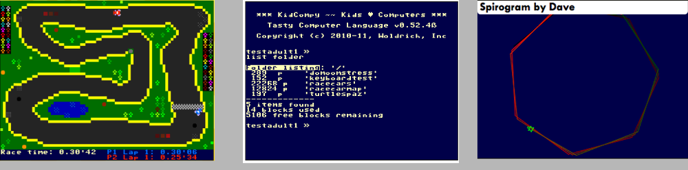

KidCompy developer portal
=========================

Introduction
------------
KidCompy is a computer simulation meant to resemble 80's 8-bit micros in appearance and function.  

We will be developing KidCompy using the web browser as the base platform, ideally without any additional plugin 
support like Java or Flash.  We will support two types of browsers in KidCompy: modern (c. 2013-onward) HTML5-compliant 
browsers and legacy Internet Explorer 6-8.  

The design goal with modern browsers is to achieve consistently high (60Hz) framerates on desktop and mobile and to 
exploit performance enhancers the platform offers like Web Workers and ASM.js so that we squeeze every last ounce of 
performance out of the host.  The goal with legacy Internet Explorer support is to create any sort of functioning 
simulation at all, leveraging polyfills and the few fast paths that IE offers to put together a useful environment.

A working prototype of this environment looked like this:

 

Why are we building KidCompy, and what is it good for?
------------------------------------------------------
This is a fair question because the KidCompy concept is quite retro, and kids of today might not care for it.  6 years 
ago when I (woldie) started working on KidCompy, it occurred to me that a generation of coders raised on Commodore, 
Atari, and Apple 8-bit micros were now having kids.  I believed these computer-savvy parents would be interested in 
reliving their formative years learning to code on a retro-styled virtual computer with their little kids.  That 
window in time for my generation to have kids in the intended age range that would enjoy KidCompy is starting to close.
So, does it still make sense to pursue creating this retro-styled virtual machine for kids?

Yes, KidCompy makes sense now and far into the future for a few reasons:

  1. Modern development environments that are accessible to kids are either:
    * too advanced:  assumes the kid has an understanding of file systems, installing programs, and importing from 
      software libraries.  Or,
    * too constrained:  drag n' drop, lego blocks, visual programming experience centered on event handling and 
      multimedia
     
     KidCopy will strike a balance between full-featured1 and accessible to computer newbies
  2. Built-in library programming environments (like BASIC on 8-bit micros) provide everything one needs to write a 
     program.  Just like BASIC, everything the computer can do can be documented as part of the language guide, which 
     is perfect for a beginner.  KidCompy will be a fully programmable virtual computer, but will still be simple enough 
     for kids learn to program on with the BASIC-like language the compy will make available at startup.
  3. Part of the fun of coding on the 80's era 8-bit microcomputers was working around the hardware limitations and 
     making the computer do something special.  KidCompy will have similar intentional "rough edges" and quirks to its
     design that will tease at interested your programmers' minds and challenge them to overcome.
  4. Being compatible with mobile browsers, KidCompy will open up a world of programming to mobile phone users who
     don't have access to a desktop computer.  Ideally, KidCompy can be a tool for learning how to program regardless
     of platform.
