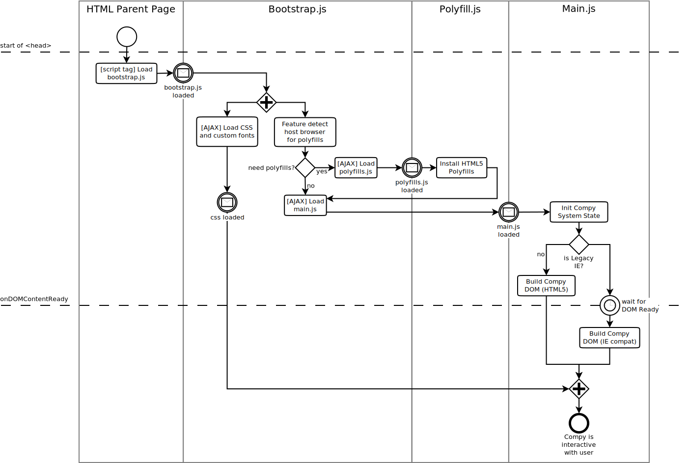

Kidcompy Modules
================

Motivation and Requirements
---------------------------

The script module breakdown in Kidcompy is motivated by the desire to run Kidcompy on modern HTML5 compliant-ish 
browsers as well as legacy Internet Explorer 6-9 platforms.  I am not interested in testing or supporting other legacy 
browsers like Firefox 1, Netscape Navigator, or early mobile browser platforms.

For modern browsers, I want the code and assets structured such that we tap into all of the optimizations in the 
platform and get good loading and runtime performance.  For legacy browsers, just getting anything that behaves and 
looks decent will mean success.  While I want to tap what few fast paths that actually exist in the legacy 
platforms, I'm not as concerned about execution speed or page loading times.  

In order to optimize the loading process and keep legacy polyfill crud out of modern browsers, we'll maintain three
scripts:  a bootstrap script, a polyfills script, and the main kidcompy script.  
 
 
 
In the diagram above, the bootstrap script will be the minimum amount of code to shim a compatible 

Webpack is currently the script bundler that we are using for Kidcompy, but we will probably not employ any of its
advanced features like chunking for fear of upsetting any old Internet Explorer ghosts.  If necessary, we will use our
own AJAX routines from the bootstrapper to load additional modules if the automatic Webpack ones are not backwards 
compatible to IE6-8.
